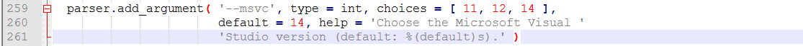
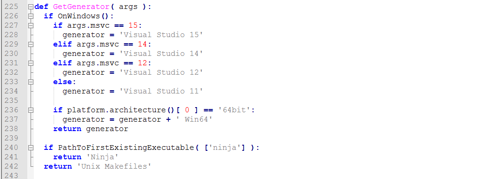

# vim-zarth: a 64-bit Vim(supproting Python) with light configuration

[TOC]

## 介绍

本人常写C++和Python各种脚本、小程序，这套配置我用了很长时间，感觉用的很舒适，很适合有相似需求的童鞋。对于想自己配置的人，本人的配置也有一定的参考价值。

恰逢本人笔记本换ssd，于是就自己编译了Vim、YCM，期间踩了很多的坑，所以也附上编译的详细教程，希望对大家有所帮助。


## 安装的插件

* Plugin 'altercation/vim-colors-solarized'
* Plugin 'scrooloose/nerdtree'
* Plugin 'majutsushi/tagbar'
* Plugin 'yianwillis/vimcdoc'
* Plugin 'scrooloose/nerdcommenter'
* Plugin 'scrooloose/syntastic'
* Plugin 'tpope/vim-fugitive'
* Plugin 'jnurmine/Zenburn'
* Plugin 'godlygeek/tabular'
* Plugin 'klen/python-mode'
* Plugin 'vim-airline/vim-airline'
* Plugin 'vim-airline/vim-airline-themes'
* Plugin 'Valloric/YouCompleteMe'


## 使用指南

有如下快捷键映射：

* 在插入模式中<ESC>映射为"kj"键
* C-e 打开NerdTree
* C-N 下一个Buffer
* C-P 上一个Buffer
* C-]查看函数原型
* C-t回到原处
* <Leader>映射为","键
* <Leader>tt 打开TagBar
* F1为中文帮助文件
* F2为Syntastic的开关
* F3为显示YCM错误列表
* F4为修补python代码风格错误
* F9为编译运行C++，运行结束后会删除可执行文件
* F10为运行python
* F12为生成Tag文件


## 安装指南

### 第一步：环境配置

* 安装mingw-w64-install.exe，并配置环境变量PATH，如PATH += C:/Python27。
* 安装mingw-w64-install.exe，注意，由于我们要编译64位的vim，所以不能用普通的mingw而要用mingw-w64，安装过程中会自动配置PATH。
* 解压ctags58.zip到任意文件夹，，并配置环境变量PATH，如PATH += C:\Tools\ctags58。
* 安装7z1604-x64.exe
* 安装vs_community__949617490.1488904476.exe，配置如图。并配置环境变量，PATH += C:\Program Files (x86)\Microsoft Visual Studio\2017\Community\VC\Tools\MSVC\14.10.25017\bin\HostX64\x64。
* 安装cmake-3.7.2-win64-x64.msi，安装过程中会自动配置PATH
* 安装Inconsolata，进入Inconsolata文件夹，点击Inconsolata for Powerline.otf选择安装
* 安装git，并设置环境变量PATH，如PATH += C:\Program Files\Git\cmd

注：以上仅为本人使用的环境，具体可根据个人需求更改。

### 第二步：编译vim（可选）

**本人已将编译好的vim打包，如果第一步完全按照教程来做，并且不想费劲，可以跳过这一步。**

编译过程：

* 下载vim-master

* 使用命令行进入vim-master/src。

* 执行如下命令，USERNAME可以自己更改。

  ```
  mingw32-make -f Make_cyg_ming.mak PYTHON=C:\Python27 DYNAMIC_PYTHON=yes PYTHON_VER=27 USERNAME=ghzhang ARCH=x86-64
  mingw32-make -f Make_cyg_ming.mak PYTHON=C:\Python27 DYNAMIC_PYTHON=yes PYTHON_VER=27 USERNAME=ghzhang ARCH=x86-64 GUI=no vim.exe
  ```

* 在任意位置创建一个文件夹，命名为vim80

* 把vim-master/runtime下所有文件拷贝到vim80中

* 把vim-master/src中所有exe文件拷贝到vim80中

* 把vim-master/src/GvimExt/gvimext.dll拷贝到vim80

* 把vim-master/src/xxd/xxd.exe拷贝到vim80

到这里，属于你的vim就算是编译完成了。

### 第三步：安装vim

* 卸载原有的vim
* 在C:\Program Files创建文件夹vim，把vim80文件夹拷贝进去
* 进入C:\Program Files\vim\vim80，运行install.exe，按照提示安装


### 第四步：拷贝配置文件

把_vimrc拷贝到用户文件夹下。如：C:\Users\username

### 第五步：安装Vundle

* 安装curl：保存如下内容为curl.cmd，将其移动到Git/cmd中，如C:\Program Files\Git\cmd

  ```
  @rem Do not use "echo off" to not affect any child calls.
  @setlocal

  @rem Get the abolute path to the parent directory, which is assumed to be the
  @rem Git installation root.
  @for /F "delims=" %%I in ("%~dp0..") do @set git_install_root=%%~fI
  @set PATH=%git_install_root%\bin;%git_install_root%\mingw\bin;%git_install_root%\mingw64\bin;%PATH%
  @rem !!!!!!! For 64bit msysgit, replace 'mingw' above with 'mingw64' !!!!!!!

  @if not exist "%HOME%" @set HOME=%HOMEDRIVE%%HOMEPATH%
  @if not exist "%HOME%" @set HOME=%USERPROFILE%

  @curl.exe %*
  ```

* 安装Vundle

  ```
  git clone https://github.com/VundleVim/Vundle.vim.git ~/.vim/bundle/Vundle.vim
  ```

* 修改_vimrc中如图处为自己的路径。

* 打开gvim，运行 `:PluginInstall`


### 第六步：安装YouCompleteMe

* 在第259行，修改代码为：

  ```
    parser.add_argument( '--msvc', type = int, choices = [ 11, 12, 14 ,15 ],
                         default = 15, help = 'Choose the Microsoft Visual '
                         'Studio version (default: %(default)s).' )
  ```

  如图，将修改为

  

* 在第225行，修改代码为：

  ```
  def GetGenerator( args ):
    if OnWindows():
      if args.msvc == 15:
        generator = 'Visual Studio 15'
      elif args.msvc == 14:
        generator = 'Visual Studio 14'
      elif args.msvc == 12:
        generator = 'Visual Studio 12'
      else:
        generator = 'Visual Studio 11'

      if platform.architecture()[ 0 ] == '64bit':
        generator = generator + ' Win64'
      return generator

    if PathToFirstExistingExecutable( ['ninja'] ):
      return 'Ninja'
    return 'Unix Makefiles'
  ```

  如图，将修改为

  

* 执行

  ```
  cd %USERPROFILE%/vimfiles/bundle/YouCompleteMe
  python install.py --clang-completer
  ```

* 修改_vimrc第242行路径

* 修改vimfiles\bundle\YouCompleteMe\third_party\ycmd\cpp\ycm\.ycm_extra_conf.py，具体的修改可以根据自己的需求。本人仅提供一个自己的简单模板作为参考。

## FAQ

- **为什么安装这么麻烦？/为什么配置文件好多没有注释？**

  由于时间有限，而且觉得不会有太多人用，所以一些工作可能不是太完善。本人会在以后逐渐完善这些问题，敬请期待。同时也欢迎向我反馈。


## 联系我

本人邮箱：ghzhang233@outlook.com

欢迎来信与我交流。